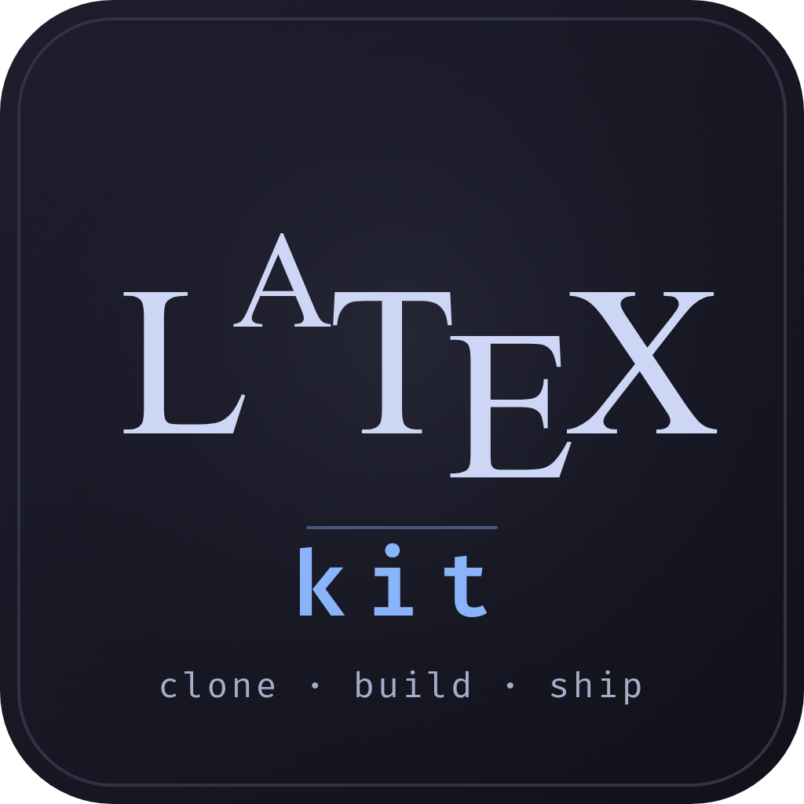

<p align="center">
  
</p>

# latex-kit

A clone-and-go LaTeX project. Same repo compiles three ways with **zero
changes**: locally, inside a Docker devcontainer, and on Overleaf.

## Start a new project

Click **"Use this template"** on GitHub, name your repo, clone it, and pick
one path below.

---

## Path A — Devcontainer (no host TeX install needed)

For when you don't want to install TeX Live on every machine you use.

**One-time per machine:** install Docker + VS Code + the
`ms-vscode-remote.remote-containers` extension.

**Then:**

```bash
git clone <your-new-repo>
cd <your-new-repo>
code .
```

VS Code shows *"Reopen in Container"* — click it. First run pulls the
`texlive/texlive:TL2025-historic` image (~1.5 GB, cached for all future
projects). Open `main.tex`, press **Ctrl+Alt+B** to build, **Ctrl+Alt+V**
to view the PDF.

---

## Path B — Native local install (faster builds, full offline)

**One-time per machine** (Linux). Installs TeX Live 2025-historic — same
release as the devcontainer and Overleaf, so all three paths produce
byte-identical PDFs:

```bash
HISTORIC=https://ftp.math.utah.edu/pub/tex/historic/systems/texlive/2025/tlnet-final
cd /tmp && wget "$HISTORIC/install-tl-unx.tar.gz"
tar -xzf install-tl-unx.tar.gz && cd install-tl-*/
perl ./install-tl --no-interaction --scheme=full -repository "$HISTORIC"
echo 'export PATH="$HOME/texlive/2025/bin/x86_64-linux:$PATH"' >> ~/.profile
# Log out + back in.
code --install-extension James-Yu.latex-workshop
```

**Per project:**

```bash
git clone <your-new-repo>
cd <your-new-repo>
code .                           # build with Ctrl+Alt+B
# or from CLI:
latexmk -pdf main.tex
```

---

## Path C — Overleaf (browser, no install)

```bash
zip -r project.zip . -x ".git/*" ".vscode/*" ".devcontainer/*" "*.aux" "*.log" "*.fls" "*.fdb_latexmk" "*.out" "*.synctex.gz" "*.toc" "*.pdf"
```

Overleaf web → **New Project → Upload Project →** drop `project.zip`.
It auto-detects `main.tex` and the `.latexmkrc`.

---

## VS Code shortcuts (Paths A & B)

| Shortcut | Action |
|---|---|
| `Ctrl+Alt+B` | Build |
| `Ctrl+Alt+V` | View PDF in side tab |
| `Ctrl+Alt+J` | Jump from source → PDF (SyncTeX) |
| Double-click PDF | Jump from PDF → source |

Auto-build on save is enabled by default.

## CLI commands

```bash
latexmk -pdf main.tex     # build (default — pdflatex)
latexmk -xelatex main.tex # build with XeLaTeX
latexmk -c                # remove aux files (keep PDF)
latexmk -C                # remove everything except sources
```

## Layout

```
main.tex                 # entry point — edit this
sections/                # \input{}-ed parts of main.tex
  introduction.tex
  conclusion.tex
figures/                 # images for \includegraphics{...}
references.bib           # bibliography (commented-out in main.tex)
.latexmkrc               # build config (honored locally + on Overleaf)
.devcontainer/           # Docker image config (Path A)
.vscode/                 # editor settings + recommended extensions
.github/                 # CI workflows + PR template + Dependabot
.gitignore               # ignores *.aux, *.log, *.pdf, etc.
assets/logo.svg          # repo logo (embedded at top of README)
scripts/                 # one-off helpers (e.g. demo GIF generator)
```

## CI / CD (GitHub Actions)

Three workflows ship with the template — they run automatically once the
repo is pushed to GitHub:

| Workflow | Trigger | What it does |
|---|---|---|
| **Build PDF** | every push to `main`, every PR | Compiles `main.tex` inside `texlive/texlive:TL2025-historic`. Uploads `main.pdf` as a workflow artifact (download from the Actions tab). |
| **Release PDF** | tag `v*` (e.g. `git tag v1.0 && git push --tags`) | Builds and publishes a GitHub Release named after the tag, with the PDF attached. |
| **Lint LaTeX** | every PR touching `*.tex` | Runs `chktex` over all `.tex` files. Advisory — never blocks merging. |

Dependabot keeps the Action versions current (monthly checks, opens PRs).

## Customize

- **Title / author** — edit the top of `main.tex`.
- **Add a section** — drop `sections/foo.tex`, add `\input{sections/foo}` in `main.tex`.
- **Enable bibliography** — uncomment `\bibliographystyle` + `\bibliography` lines near the bottom of `main.tex`, then `\cite{key}` from `references.bib`.
- **Switch compiler** — in `.latexmkrc`: `$pdf_mode = 5;` (xelatex) or `4` (lualatex), and remove the `$pdflatex = ...` line.

## Overleaf compatibility rules

These are baked in — keep them when you add files:

- Main `.tex` stays at the project root (Overleaf requires this).
- All `\input{...}` and `\includegraphics{...}` paths are relative to the root.
- Custom `.cls` / `.sty` / fonts live inside the repo (Overleaf can't see outside).
- No build scripts at compile time — anything beyond `latexmk` goes in `.latexmkrc`.
